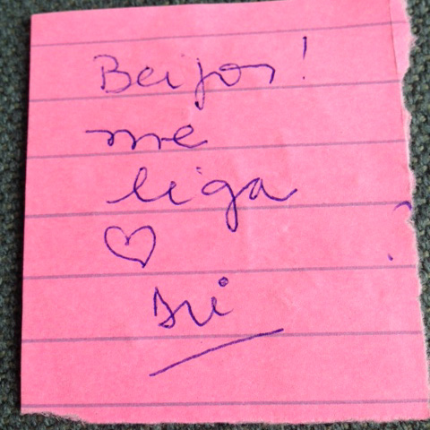

# Projeto IA Generativa – DIO

## Sobre o projeto

Esse projeto foi feito como parte do bootcamp da DIO, e a proposta era explorar a IA generativa usando ferramentas como o **Microsoft Copilot** e **Azure OpenAI**. A ideia era aplicar reconhecimento de texto em imagens (tipo um OCR), gerar conteúdo e entender como essas ferramentas funcionam.

Infelizmente não consegui usar a plataforma no momento, mas estudei bastante o conteúdo e simulei o processo com exemplos práticos.

---

## Estrutura do repositório

- 📁 `inputs/`: onde ficam as imagens que seriam analisadas.
- 📁 `output/`: onde colocamos os textos que a IA reconheceria.
- 📄 `README.md`: você está aqui! Explico o que aprendi e como tudo funciona.

---

## Simulação do processo

Escolhi uma imagem simples, escrita à mão, bem no estilo "vida real" mesmo. Olha só:

### 📥 Imagem de entrada:

### 📤 Resultado do reconhecimento:
Beijo! me liga ❤ Mi

---

## O que aprendi

Mesmo sem rodar o lab, entendi os principais pontos:

- O **Microsoft Copilot** pode ajudar na rotina com tarefas automatizadas, sugestões de texto, planilhas e muito mais.
- O **Azure OpenAI** permite criar soluções personalizadas com inteligência artificial (usando GPT, por exemplo).
- Os **filtros de conteúdo** são importantes pra manter a segurança e ética nas respostas da IA.
- Reconhecimento de texto (OCR) pode ser usado pra transformar imagens em texto útil e tratável.

---

## Aplicações possíveis

Essas tecnologias têm muito potencial:

- Automatizar respostas de atendimento ao cliente;
- Criar assistentes virtuais inteligentes;
- Fazer resumos de textos longos;
- Reconhecer e tratar textos de imagens (como notas fiscais, cartas, post-its... rs).

---

## Conclusão

Mesmo sem a prática 100% funcional, deu pra mergulhar nos conceitos e entender como a IA generativa pode ser usada no dia a dia de forma criativa e produtiva. E claro, esse projeto já está aqui no GitHub pra mostrar que o aprendizado não para!
